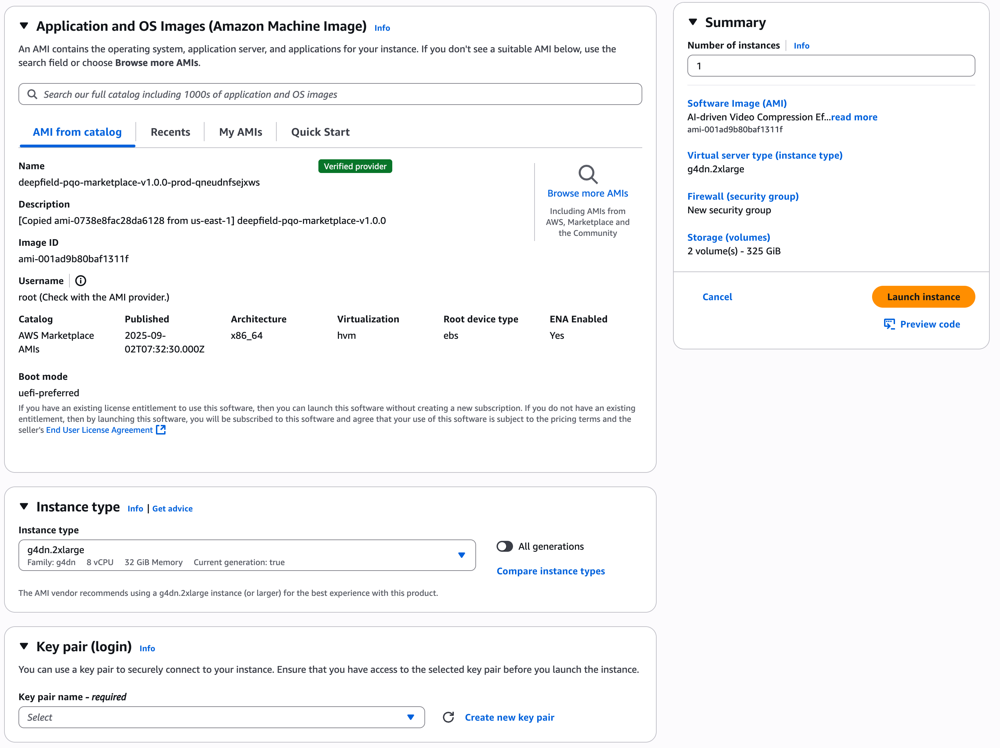

**Table Of Contents**

[1 CREATING AN INSTANCE WITH DeepField-PQO AMI](#1-creating-an-instance-with-deepfield-pqo-ami)<br/>
[2 TRY OUR DeepField-PQO SOLUTIONS](#2-try-our-deepfield-pqo-solution)<br/>
[3 REFERENCES](#3-references)<br/>

---

# 1 Creating an instance with DeepField-PQO AMI

## PROCEDURE

### Step 1. Choose the AMI we shared

- Click “Launch instance” in EC2 console
- Type "DeepField-PQO" in the search box and select it.

### Step 2. Choose g4dn.2xlarge instance

choose g4dn.2xlarge
<br/>

<br/>

### Step 3. Review and launch the instance

- Create a private key if you have no existing key and download it.
  <br/>
  
  <br/>
- Click "Launch Instances"

### Step 4. Connect to your instance

```bash
chmod 600 <private_key_path>
ssh -i <private_key_path> ubuntu@<ip_address>
```

Then you can see the following messages:

```
 ██████  ███████ ███████ ██████  ███████ ██ ███████ ██      ██████        ██████   ██████   ██████
 ██   ██ ██      ██      ██   ██ ██      ██ ██      ██      ██   ██       ██   ██ ██    ██ ██    ██
 ██   ██ █████   █████   ██████  █████   ██ █████   ██      ██   ██ █████ ██████  ██    ██ ██    ██
 ██   ██ ██      ██      ██      ██      ██ ██      ██      ██   ██       ██      ██ ▄▄ ██ ██    ██
 ██████  ███████ ███████ ██      ██      ██ ███████ ███████ ██████        ██       ██████   ██████
                                                                                     ▀▀
                                                                                 https://blue-dot.io
                                                                                 contact@blue-dot.io
#### HOWTO ####
ffmpeg -i 720p_sports.mp4 -vf bdpqo_aws=pqo_model=pqoex13 -c:v libx264 output.mp4

sample clips
- 720p_sports.mp4
- 720p_musicvideo.mp4
```

# 2 Try our DeepField-PQO solution

### ffmpeg with default options

```bash
ffmpeg -hide_banner -y -i 720p_musicvideo.mp4 -vf bdpqo_aws -c:v libx264 output.mp4
```

#### ffmpeg with custom options

```bash
### ex13
ffmpeg -hide_banner -y -i 720p_musicvideo.mp4 -vf bdpqo_aws=pqo_model=pqoex13 -c:v libx264 output.mp4
```

#### Select GPU to use

Similar to the bluedot.sh script, you can also set CUDA_VISIBLE_DEVICES=X before executing ffmpeg commands to select a specific GPU.

```bash
### Use 1st GPU
CUDA_VISIBLE_DEVICES=0 ffmpeg -hide_banner -y -i 720p_musicvideo.mp4 -vf bdpqo_aws -c:v libx264 output.mp4

### Use 2nd GPU
CUDA_VISIBLE_DEVICES=1 ffmpeg -hide_banner -y -i 720p_musicvideo.mp4 -vf bdpqo_aws -c:v libx264 output.mp4
```

# 3 References

## Using the terminal in VS Code

Because the terminal in VS Code starts as a non-login shell, run the following command:

```
bash -l
```

## bdpqo_aws filter options

```
Filter bdpqo_aws
  Perceptual Quality Enhancer. AWS version (C)BLUEDOT.
    Inputs:
       #0: bdpqo_aws_in (video)
    Outputs:
       #0: bdpqo_aws_out (video)
bdpqo_aws AVOptions:
   pqo_model         <string>     ..FV....... pqo_model: pqoconv, pqoconv2, pqoex13 (default pqoconv) (default "pqoconv")
   clip              <int>        ..FV....... clip: n (default 0) (from 0 to 100) (default 0)

This filter has support for timeline through the 'enable' option.
```

# 4 Use Cases for DeepField-PQO AMI with AWS Elemental

The DeepField-PQO is a next-generation AI-based pre-processor that intelligently optimizes video data prior to the encoder. This document describes two representative live integration use cases within the AWS Elemental environment (MediaConnect, MediaLive, MediaConvert).

### [Use case A : MediaConnect → DeepField-PQO → MediaLive](./use-cases/live.md)

### [Use case B : S3 → DeepField-PQO → MediaConvert](./use-cases/vod.md)
