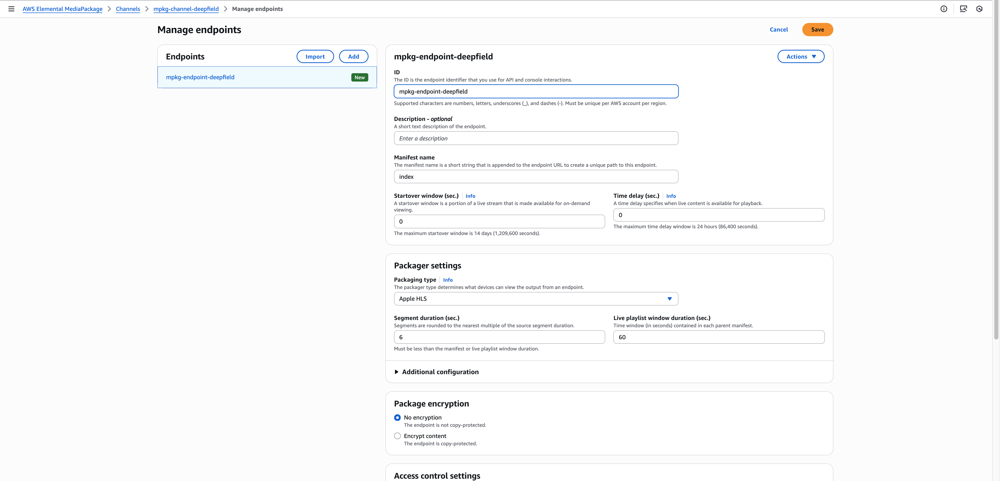

# Use case A : MediaConnect → DeepField-PQO → MediaLive

This use case describes a workflow where live streams are received through AWS Elemental MediaConnect, intelligently optimized by the DeepField-PQO server prior to encoding, ABR-encoded with MediaLive, and then packaged with AWS Elemental MediaPackage to deliver to viewers efficiently with reduced bandwidth usage while maintaining visual quality.

## Architecture

<br/>

<br/>

## Prerequisites

Before you can use AWS Elemental MediaConnect, MediaLive, MediaPackage, you need an AWS account and the appropriate permissions to access, view, and edit. For detailed information, see [AWS Elemental MediaConnect](https://docs.aws.amazon.com/ko_kr/mediaconnect/latest/ug/setting-up.html), [AWS Elemental MediaLive](https://docs.aws.amazon.com/medialive/latest/ug/setting-up.html), [AWS Elemental MediaPackage](https://docs.aws.amazon.com/mediapackage/latest/ug/setting-up.html)

## Workflow

### Step 1. Send a live stream with SRT-enabled live equipment

You can use any live stream source, but in this example we use OBS Studio.

1. In OBS, go to **Settings > Stream**.

- Service → `Custom`
- Server → The inbound IP address(srt) listed under **Sources** in the **MediaConnect flow**. (ex. srt://203.0.113.25:9710?mode=caller)
- Choose **Ok**

2. Choose **Start Streaming**.

### Step 2. AWS Elemental MediaConnect configuration

#### Create MediaConnect flow

1. On the **Flows** page, choose **Create flow**.
2. **Details** :

- Name → ex) `deepfield-mediaconnect`
- Flow size → `Medium`

3. **Source** :

- Source type → `Standard source`
- Name → ex) `deepfield-mediaconnect-source`
- Protocol → `SRT listener`
- Allowlist CIDR block → `0.0.0.0/0`
- Inbound port → `9710`

4. Choose **Create flow**

<br/>

<br/>

#### Create MediaConnect output

1. On the **Flows** page, choose flow.
2. Go to the **Outputs** tab, and choose **Add output**.

- Name → ex) `deepfield-mediaconnect-output`
- Output type → `Standard output`
- Protocol → `SRT caller`
- Destination address → `Enter DeepField-PQO IP`(ex. 203.0.113.25)
- Port → `9710`
- Choose **Add Output**

3. Choose **Start**.

<br/>

<br/>

<br/>

<br/>

### Step 3. Run DeepField-PQO

```bash
ffmpeg -i "srt://0.0.0.0:<MEDIACONNECT_PORT>?mode=listener" \
  -vf bdpqo_aws=pqo_model=pqoex13 -c:v h264_nvenc -g 60 -b:v 15M -f flv \
  "rtmp://<MEDIALIVE_INPUT_ENDPOINT>"
```

- `"srt://0.0.0.0:<MEDIACONNECT_PORT>?mode=listener"`
  - The local SRT listener address where the DeepField-PQO receives the incoming stream from MediaConnect.
  - `<MEDIACONNECT_PORT>` should match the inbound port configured in the MediaConnect flow (ex. 9710).
- `"rtmp:<MEDIALIVE_INPUT_ENDPOINT>"`
  - The output destination where FFmpeg sends the processed video stream.
  - Replace `<MEDIALIVE_INPUT_ENDPOINT>` with the Endpoint URL shown on the details page of the MediaLive input you created.

### Step 4. AWS Elemental MediaPackage configuration

Create a channel to start receiving content streams. Later, you add an endpoint to the channel. This endpoints is the access point for content playback request.

1. In the navigation pane, under **Live v1**, choose **Channels**.
2. On the **Channels** page, choose **Create Channel**.

- **Channel details**
  - ID → ex) `mpkg-channel-deepfield`
  - Input type → `Apple HLS`
- Choose **Create**.

3. On the details page for the channel, under **Origin endpoints**, choose **Manage endpoints**.

- ID → ex) `mpkg-endpoint-deepfield`
- Choose **Save**.

<br/>

<br/>

<br/>

<br/>

### Step 5. AWS Elemental MediaLive configuration

#### Create MediaLive input

1. On the **Inputs** page, choose **Create input**.

- **Input details**
  - Input name → ex) `deepfield_input`
  - Input type → `RTMP(push)`
- **Input security group** : Choose `0.0.0.0/0`
- **Input destinations**
  - Destination A, B: Application name → ex) `bluedot`, Application instance → ex) `deepfield`
  - > **Note**  
    > These values are used in the RTMP URL for `rtmp://<HOST>/<APPLICATION_NAME>/<APPLICATION_INSTANCE>`.  
    > The same path must be used by the encoder (ex. FFmpeg) when pushing the stream to MediaLive.
- Choose **Create input**.

2. On the details page for the input, the **URL** under **Endpoints** serves as the output address of the DeepField-PQO server.

<br/>

<br/>
<br/>

<br/>
<br/>

<br/>

#### Create MediaLive channel

1. On the **Channels** page, choose **Create channel**.

- **General info**
  - Channel name → ex) `deepfield-live-channel`
- **Input attachments**
  - Choose **Add**
  - **Attach input**: Input → Select `deepfield_input`
  - Choose **Confirm**
- **Output groups**
  - Add output group → `MediaPackage`
- **MediaPackage group**
  - **MediaPackage destination**
    - Choose `Use HLS output`
    - MediaPackage channel group name → `mpkg-channel-deepfield`
  - **MediaPackage outputs**
    - Choose `Settings`
    - Video: Width → `1280`, Height → `720`, Codec Setting → `H264`
    - Aspect Rato > PAR Control → `SPECIFIED`, PAR Numerator → `1`, PAR Dominator → `1`
    - Frame Rate > Framerate Control → `SPECIFIED`, Framerate Numerator → `30`, Framerate Deniminator → `1`
- Choose **Create channel**.

<br/>

<br/>

<br/>

<br/>

<br/>

<br/>

<br/>

<br/>

#### Start MediaLive channel

- In the navigation pane, choose **Channels**, and then on the **Channels** page, choose the channel that you want to start.
- Click **Start**. The channel state will change to either Starting or Running.
- After a few seconds, the thumbnail preview of the current input appears (if thumbnail preview is enabled).

<br/>

<br/>

### Step 6. Play live stream

On the details page of the MediaPackage channel, under **Origin endpoints**, you can check the endpoint you created above. If you open the **Endpoint URL** in Safari browser or in [hls.js demo](https://hlsjs.video-dev.org/demo), you can watch the real-time live broadcast.

<br/>

<br/>
